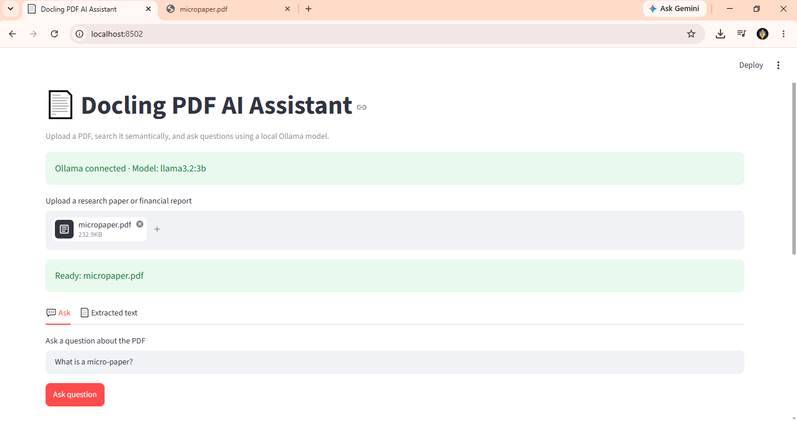

# 📄 Docling Ollama RAG Assistant

A local Retrieval-Augmented Generation (RAG) application that lets users upload PDF documents, search them semantically, and ask questions using a local LLM.

This project uses **Docling** for PDF extraction, **Sentence Transformers** for embeddings, **FAISS** for semantic search, **Ollama** for local LLM inference, and **Streamlit** for the user interface.



---

## 🚀 Features

- Upload PDF research papers and reports
- Extract structured text using Docling
- Split documents into overlapping chunks
- Generate embeddings using Sentence Transformers
- Perform semantic search using FAISS
- Retrieve relevant document passages
- Generate answers using Ollama locally
- Display retrieved sources and similarity scores
- Download extracted Markdown
- No OpenAI API key required
- No paid LLM API required for local usage

---

## 🧠 Architecture

```text
PDF Upload
    ↓
Docling
    ↓
Extracted Markdown
    ↓
Text Chunking
    ↓
SentenceTransformer Embeddings
    ↓
FAISS Vector Index
    ↓
Semantic Search
    ↓
Top Relevant Chunks
    ↓
Ollama Local LLM
    ↓
Generated Answer
```

---

## 🛠 Tech Stack

- Python
- Streamlit
- Docling
- Sentence Transformers
- FAISS
- Ollama
- Llama 3.2
- PyTorch
- Requests

---

## 📂 Project Structure

```text
docling-ollama-rag/
│
├── app.py
├── requirements.txt
├── README.md
├── .gitignore
└── .venv/
```

> `.venv/` should not be uploaded to GitHub.

---

## ⚙️ Installation

### 1. Clone the Repository

```bash
git clone https://github.com/YOUR_USERNAME/docling-ollama-rag.git
cd docling-ollama-rag
```

### 2. Create a Virtual Environment

Windows:

```powershell
py -3.12 -m venv .venv
```

Activate it:

```powershell
.\.venv\Scripts\Activate.ps1
```

### 3. Install Dependencies

```powershell
pip install -r requirements.txt
```

If PyTorch causes DLL issues on Windows, install the CPU build separately:

```powershell
pip install torch==2.8.0 torchvision==0.23.0 --index-url https://download.pytorch.org/whl/cpu
```

---

## 🦙 Install Ollama

Install Ollama from:

https://ollama.com/

Then download the model:

```powershell
ollama pull llama3.2:3b
```

Check installed models:

```powershell
ollama list
```

Test the model:

```powershell
ollama run llama3.2:3b
```

Exit the Ollama chat using:

```text
/bye
```

---

## ▶️ Run the Application

Activate the environment:

```powershell
.\.venv\Scripts\Activate.ps1
```

Run Streamlit:

```powershell
streamlit run app.py
```

The application will usually open at:

```text
http://localhost:8501
```

---

## 💬 Example Usage

1. Upload a research paper or financial report in PDF format.
2. Wait for Docling to extract and process the document.
3. Ask a question such as:

```text
What are the main findings of this paper?
```

4. The application embeds the question.
5. FAISS retrieves the most relevant document chunks.
6. The retrieved chunks are sent to the local Ollama model.
7. Ollama generates an answer based on the retrieved context.

---

## 🔍 How It Works

### 1. PDF Parsing

Docling processes the uploaded PDF and converts the document into Markdown.

### 2. Chunking

The extracted document is divided into smaller overlapping text chunks.

```text
Document
├── Chunk 1
├── Chunk 2
├── Chunk 3
└── Chunk N
```

Overlapping chunks help preserve context between sections.

### 3. Embeddings

Each text chunk is converted into a numerical vector using:

```text
all-MiniLM-L6-v2
```

The embedding model represents the semantic meaning of each text chunk.

### 4. FAISS Vector Search

The embeddings are stored in a FAISS index.

When the user asks a question, the question is also converted into an embedding.

FAISS searches for the document chunks with the highest semantic similarity.

### 5. Retrieval

The application retrieves the most relevant chunks.

```text
User Question
      ↓
Question Embedding
      ↓
FAISS
      ↓
Top Relevant Chunks
```

### 6. LLM Generation

The question and retrieved chunks are sent to the local Ollama model:

```text
llama3.2:3b
```

Ollama generates the final answer based on the retrieved document context.

---

## 🧩 RAG Pipeline

```text
                ┌───────────────┐
                │   PDF Upload   │
                └───────┬───────┘
                        │
                        ▼
                ┌───────────────┐
                │    Docling     │
                └───────┬───────┘
                        │
                        ▼
                ┌───────────────┐
                │ Text Chunking  │
                └───────┬───────┘
                        │
                        ▼
                ┌─────────────────────┐
                │ SentenceTransformer │
                └─────────┬───────────┘
                          │
                          ▼
                ┌───────────────┐
                │     FAISS      │
                └───────┬───────┘
                        │
                Relevant Chunks
                        │
                        ▼
                ┌───────────────┐
Question ──────►│    Ollama      │
                │ llama3.2:3b    │
                └───────┬───────┘
                        │
                        ▼
                     Answer
```

---

## 🤖 Why Ollama?

The first version of this project used a cloud LLM API.

The project was migrated to Ollama to support local inference.

Benefits include:

- No paid LLM API required
- No API key required
- Local inference
- Better privacy for uploaded documents
- Easier experimentation with open-source models
- Useful for learning local AI infrastructure

---

## 📦 Example `requirements.txt`

```text
streamlit
docling
sentence-transformers
faiss-cpu
requests
numpy
torch==2.8.0
```

Depending on your environment, PyTorch may be installed separately using the official CPU wheel.

---

## 🙈 Example `.gitignore`

```gitignore
.venv/
.env
__pycache__/
*.pyc
.DS_Store
.streamlit/
```

This prevents virtual environments, secrets, caches, and local configuration files from being uploaded to GitHub.

---

## ⚠️ Current Limitations

- Designed primarily for local execution
- Requires Ollama to be installed
- Ollama must be running locally
- Large models may be slow without a GPU
- Uses fixed-size character chunking
- FAISS index is stored only in memory
- No persistent vector database
- No conversational memory yet
- Currently processes one PDF at a time
- Answer quality depends on retrieval quality and the local model

---

## 🔮 Future Improvements

Planned improvements:

- Semantic chunking
- Section-aware document chunking
- Multiple PDF support
- Conversation history
- Streaming LLM responses
- Source citations
- Hybrid search
- BM25 + vector search
- Reranking
- Persistent vector database
- Chroma or Qdrant integration
- FastAPI backend
- Docker containerization
- Automated tests
- GitHub Actions CI/CD
- Logging
- Monitoring
- RAG evaluation
- Multiple Ollama model selection

---

## 🎯 AI Engineering Concepts Demonstrated

This project demonstrates practical concepts used in AI engineering:

- Retrieval-Augmented Generation
- LLM application development
- Local LLM inference
- Document processing
- Embeddings
- Vector search
- Semantic retrieval
- Prompt engineering
- Model integration
- AI application deployment
- Streamlit application development

---

## 📚 Learning Goals

The purpose of this project is to learn how different AI components work together in a complete system.

Instead of training a large language model from scratch, this project focuses on building an end-to-end AI application around existing models.

The project demonstrates how:

```text
Documents
+
Embedding Models
+
Vector Search
+
Retrieval
+
Large Language Models
+
Application UI
```

can be combined into a functional RAG system.

---

## 📄 License

This project is intended for educational and portfolio purposes.